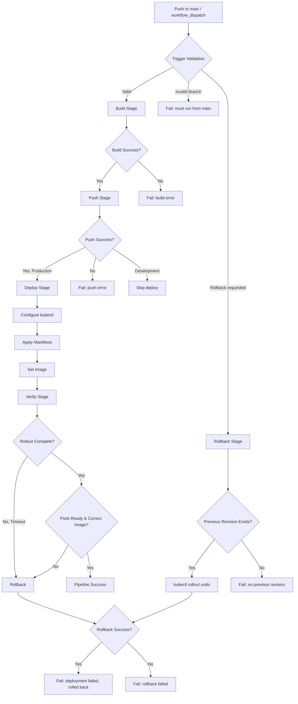
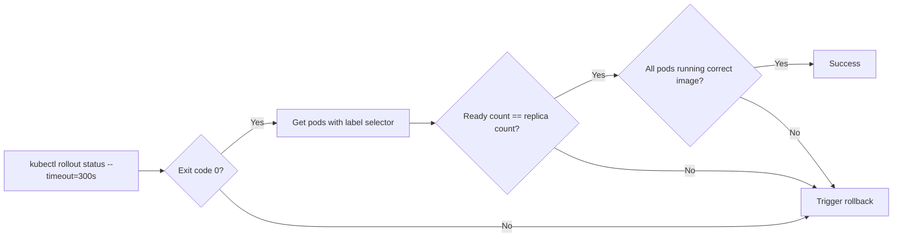

# Design Document: k8s-cicd-pipeline

## Overview

This feature implements a GitHub Actions CI/CD pipeline that builds the Termix Docker image, pushes it to Docker Hub, and deploys it to a Kubernetes cluster in the `termix` namespace. The design extends the existing `docker.yml` workflow by adding Kubernetes deployment, verification, and rollback capabilities.

The pipeline consists of four sequential stages:
1. **Build** — Build Docker image from `docker/Dockerfile`
2. **Push** — Push tagged image to Docker Hub (production only)
3. **Deploy** — Apply Kubernetes manifests and update the deployment image
4. **Verify** — Confirm rollout completion, pod readiness, and image correctness

A separate rollback path allows reverting to the previous deployment revision if verification fails or via manual trigger.

## Architecture



### Workflow File Structure

```
.github/workflows/
├── docker.yml              (existing — build & push only)
└── k8s-deploy.yml          (new — full CI/CD with K8s deploy)

k8s/
├── namespace.yml           (Namespace definition)
├── configmap.yml           (Non-sensitive env vars)
├── deployment.yml          (Deployment + containers)
├── service.yml             (ClusterIP Service)
└── pvc.yml                 (PersistentVolumeClaim)
```

## Components and Interfaces

### 1. GitHub Actions Workflow (`k8s-deploy.yml`)

**Triggers:**
- `push` to `main` branch
- `workflow_dispatch` with inputs: `version` (required string), `build_type` (choice: Development/Production), `rollback` (boolean, default false)

**Jobs:**

| Job | Runs On | Depends On | Purpose |
|-----|---------|------------|---------|
| `validate` | ubuntu-latest | — | Validates branch and inputs |
| `build` | ubuntu-latest | validate | Builds and tags Docker image |
| `push` | ubuntu-latest | build | Pushes to Docker Hub (Production only) |
| `deploy` | ubuntu-latest | push | Applies K8s manifests, sets image |
| `verify` | ubuntu-latest | deploy | Checks rollout, pods, image |
| `rollback` | ubuntu-latest | verify (on failure) or manual | Reverts to previous revision |

**Interfaces:**
- **Inputs**: version, build_type, rollback flag
- **Secrets**: `DOCKER_HUB_USERNAME`, `DOCKER_HUB_PASSWORD`, `KUBE_CONFIG`
- **Outputs**: Deployment status logged per-step

### 2. Kubernetes Manifests (`k8s/`)

**deployment.yml** — Core workload definition:
- 2 replicas (default)
- Image: `docker.io/{DOCKER_HUB_USERNAME}/termix:PIPELINE_IMAGE_TAG`
- Resource requests: 128Mi memory, 100m CPU
- Resource limits: 512Mi memory, 500m CPU
- Liveness/readiness probes on port 30001, path `/health`
- Container ports: 8080 (app), 30001 (health)
- Volume mount: `/app/data` from PVC
- `envFrom`: ConfigMap and Secret references

**service.yml** — Network exposure:
- Type: ClusterIP
- Port 8080 → targetPort 8080

**pvc.yml** — Persistent storage:
- AccessMode: ReadWriteOnce
- Storage: 1Gi minimum

**configmap.yml** — Non-sensitive environment:
- PORT, NODE_ENV, GUACD_HOST, ENABLE_SSL, BASE_PATH

### 3. Image Tagging Strategy

| Condition | Tags Applied |
|-----------|-------------|
| Push to main | `<sha7>`, `latest` |
| workflow_dispatch (Production) | `<sha7>`, `latest` |
| workflow_dispatch (Development) | `<sha7>` (no push to Docker Hub) |

Where `<sha7>` is the first 7 characters of the Git commit SHA.

### 4. Deployment Verification Logic



### 5. Rollback Mechanism

- Triggered automatically on verification failure
- Triggered manually via `workflow_dispatch` with `rollback: true`
- Uses `kubectl rollout undo deployment/termix -n termix`
- Waits up to 120 seconds for rollback completion
- Reports revision number restored and success/failure status

## Data Models

### Workflow Inputs Schema

```yaml
inputs:
  version:
    type: string
    required: true
    description: "Semantic version (e.g., 1.8.0)"
  build_type:
    type: choice
    options: [Development, Production]
    required: true
  rollback:
    type: boolean
    default: false
    description: "Roll back to previous revision without building"
```

### Kubernetes Resource Specifications

```yaml
# Deployment container spec
containers:
  - name: termix
    image: "docker.io/DOCKER_HUB_USERNAME/termix:PIPELINE_IMAGE_TAG"
    ports:
      - containerPort: 8080
        name: http
      - containerPort: 30001
        name: health
    resources:
      requests:
        memory: "128Mi"
        cpu: "100m"
      limits:
        memory: "512Mi"
        cpu: "500m"
    livenessProbe:
      httpGet:
        path: /health
        port: 30001
      initialDelaySeconds: 60
      periodSeconds: 30
      timeoutSeconds: 10
      failureThreshold: 3
    readinessProbe:
      httpGet:
        path: /health
        port: 30001
      initialDelaySeconds: 60
      periodSeconds: 30
      timeoutSeconds: 10
      failureThreshold: 3
    envFrom:
      - configMapRef:
          name: termix-config
      - secretRef:
          name: termix-secrets
          optional: false
    volumeMounts:
      - name: termix-data
        mountPath: /app/data
```

### PersistentVolumeClaim

```yaml
spec:
  accessModes:
    - ReadWriteOnce
  resources:
    requests:
      storage: 1Gi
```

## Error Handling

| Stage | Failure Condition | Action |
|-------|-------------------|--------|
| Validate | Non-main branch dispatch | Fail with "releases must be run from main branch" |
| Build | Docker build fails | Fail workflow, log build error |
| Push | Auth fails | Fail workflow, log "authentication failure" |
| Push | Push fails after auth | Fail workflow, log "push failure" |
| Deploy | kubectl connectivity fails | Fail workflow, log connection error |
| Deploy | Manifest apply fails | Fail workflow, log deployment error |
| Verify | Rollout timeout (300s) | Trigger rollback, log timeout |
| Verify | Pod count mismatch | Trigger rollback, log mismatch |
| Verify | Wrong image on pods | Trigger rollback, log image mismatch |
| Rollback | No previous revision | Fail workflow, log "no previous revision" |
| Rollback | Rollback timeout (120s) | Fail workflow, log rollback failure |
| Rollback | Rollback command fails | Fail workflow, log rollback failure |

Each failure reports a clear, actionable message in the GitHub Actions job logs. Rollback is the automatic recovery mechanism — if it also fails, the pipeline terminates with a critical failure requiring manual intervention.

## Testing Strategy

### Why Property-Based Testing Does Not Apply

This feature is entirely **Infrastructure as Code** and **CI/CD configuration**:
- GitHub Actions workflows are declarative YAML configurations
- Kubernetes manifests are declarative resource definitions
- There are no pure functions, data transformations, parsers, or business logic

Property-based testing requires universally quantified properties over varying inputs. Pipeline and manifest configurations are static declarations — they either match the specification or they don't. The correct testing strategies are validation, linting, and integration tests.

### Testing Approach

**1. YAML Linting & Schema Validation**
- Validate GitHub Actions workflow syntax using `actionlint`
- Validate Kubernetes manifests using `kubeval` or `kubeconform` against the target K8s API version
- Run as a pre-commit check or PR check

**2. Manifest Unit Tests**
- Use `kube-score` to check Kubernetes best practices (resource limits, probes, security context)
- Verify manifest structure matches requirements (replica count, ports, resource values, probe config)
- Example: assert deployment replicas == 2, resource limits == 512Mi/500m

**3. Dry-Run Validation**
- `kubectl apply --dry-run=client` against manifests to confirm they are syntactically valid
- `kubectl diff` to preview changes before applying

**4. Integration Tests (against real or mock cluster)**
- Deploy to a `kind` (Kubernetes in Docker) cluster in CI
- Verify pod startup, health endpoint response, service routing
- Test rollback flow by deploying a bad image and confirming recovery
- Test that missing secrets prevent pod startup (optional: false behavior)

**5. Workflow Tests**
- Use `act` (local GitHub Actions runner) to validate workflow logic
- Test trigger conditions (main branch only, workflow_dispatch inputs)
- Verify job dependencies and conditional execution paths

**6. Smoke Tests (post-deploy)**
- After deploy to real cluster: hit `/health` on port 30001
- Verify pod count matches expected replicas
- Verify running image tag matches the deployed SHA
